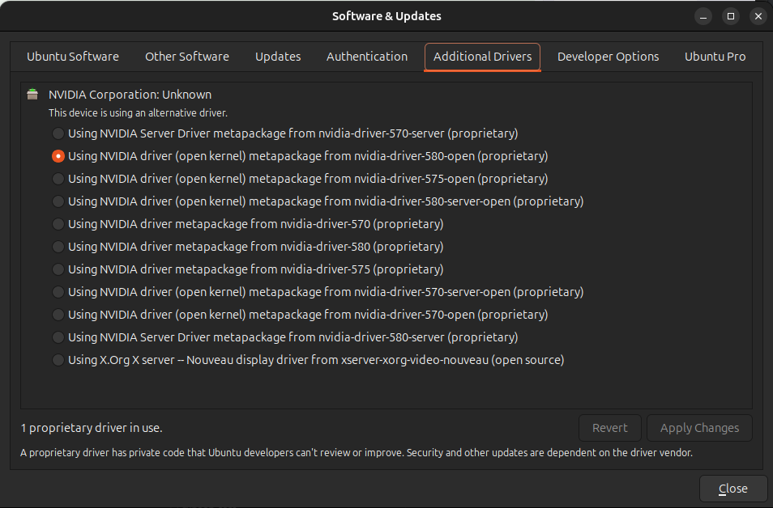

# Habitat-lab 3.0安装与环境配置

## 目录

- **[在Ubuntu上进行安装](#install-on-ubuntu)**

- **[常见报错与解决方案](#troubleshooting)**

<a id="install-on-ubuntu"></a>

## 在Ubuntu上进行安装

### 安装Ubuntu系统

1. 从[Ubuntu官网下载地址](https://ubuntu.com/download/desktop)下载**Ubuntu Desktop 24.04 LTS**系统映像

2. 安装Ubuntu双系统
   
   - Ubuntu To Go：使用[VMWare Workstation Pro](https://knowledge.broadcom.com/external/article/344595/downloading-and-installing-vmware-workst.html)和[图吧工具箱](https://www.tbtool.cn/)中的**DiskGenius**安装，可参考[视频教程](https://www.bilibili.com/video/BV14BxRedEnG)
3. 启动系统

   >*注意：建议在安装时系统语言选择英语，若选择中文，Ubuntu生成的用户文件夹将会是中文路径，例如 `~/桌面` `~/下载`,会给使用造成一些不必要的麻烦。如果已经选择中文安装，可以[查看教程](https://gist.github.com/dslwind/0eceae9ecc6026c6d22ce81dfca231c0)修改*
### 安装NVIDIA驱动
Ubuntu自带nouveau驱动，能够提供非常非常~~基础~~（简陋）的功能。初次启动的时候如果出现非常严重的拖影和画面撕裂，就是nouveau造成的。因此，为了正常输出画面并且正常使用CUDA等功能，我们需要安装NVIDIA驱动。

Ubuntu 24.04提供了系统内置的驱动安装方式：
**软件与更新（Software & Updates）>额外驱动（Additional Drivers）**

选择驱动版本后点击**应用修改（Apply Changes）**，再点击**重启Restart**
>*注意：NVIDIA驱动命名一般为 `nvidia-driver-{版本号}-{后缀}`。后缀 `-open` 说明该驱动基于[Nvidia开源GPU内核模块](https://developer.nvidia.com/blog/nvidia-transitions-fully-towards-open-source-gpu-kernel-modules/)，对于RTX20系列及以后的显卡都推荐安装open驱动。Blackwell架构（RTX50系列）只能安装open驱动，不然会出现开机黑屏的问题。 `-server` 主要用于服务器等headless场景，这里不作介绍。*

重启后应该不会再出现拖影/画面撕裂的问题。打开**终端Terminal**，输入 `nvidia-smi`，如果驱动安装成功，应该能够看到如下输出：
```
$ nvidia-smi
Fri Nov  7 19:23:38 2025       
+-----------------------------------------------------------------------------------------+
| NVIDIA-SMI 580.95.05              Driver Version: 580.95.05      CUDA Version: 13.0     |
+-----------------------------------------+------------------------+----------------------+
| GPU  Name                 Persistence-M | Bus-Id          Disp.A | Volatile Uncorr. ECC |
| Fan  Temp   Perf          Pwr:Usage/Cap |           Memory-Usage | GPU-Util  Compute M. |
|                                         |                        |               MIG M. |
|=========================================+========================+======================|
|   0  NVIDIA GeForce RTX 5080        Off |   00000000:02:00.0  On |                  N/A |
|  0%   39C    P8             19W /  360W |    3762MiB /  16303MiB |      2%      Default |
|                                         |                        |                  N/A |
+-----------------------------------------+------------------------+----------------------+
```
为了能够正常使用CUDA功能，我们还需要[安装cuda驱动](https://developer.nvidia.com/cuda-downloads?target_os=Linux&target_arch=x86_64&Distribution=Ubuntu&target_version=24.04&target_type=deb_local)，按照**CUDA Toolkit Installer**中的安装教程安装

安装完成后，在**终端Terminal**中输入 `nvcc -V`， 应该能够看到如下输出:
```
$ nvcc -V
nvcc: NVIDIA (R) Cuda compiler driver
Copyright (c) 2005-2025 NVIDIA Corporation
Built on Wed_Aug_20_01:58:59_PM_PDT_2025
Cuda compilation tools, release 13.0, V13.0.88
Build cuda_13.0.r13.0/compiler.36424714_0
```
至此，NVIDIA显示驱动与CUDA驱动已经安装完毕
### 安装Miniconda
为了更方便管理python环境，我们需要安装miniconda管理虚拟环境。在**终端Terminal**中输入
```
wget https://repo.anaconda.com/miniconda/Miniconda3-latest-Linux-x86_64.sh
```
然后执行安装
```
bash ~/Miniconda3-latest-Linux-x86_64.sh
```
当看到 `Thank you for installing Miniconda3` 时说明Miniconda已经安装完毕。关闭当前**终端Terminal**并开启一个新的**终端Terminal**，在用户名前能够看到当前激活的环境名称，如 `(base)name@device-name:~$`
### 安装Habitat-lab 3.0
鉴于[官方安装教程](https://github.com/facebookresearch/habitat-lab?tab=readme-ov-file#installation)存在一些广泛出现的问题，所以在这里重写一遍安装教程
1. **准备Conda环境**

   ```
   #不建议自行修改python和cmake，可能会带来很多依赖错误
   conda create -n habitat python=3.9 cmake=3.14.0
   conda activate habitat
   ```

2. **在Conda环境中安装habitat-sim**
   ```
   conda install habitat-sim withbullet -c conda-forge -c aihabitat
   ```
3. **通过pip安装habitat-lab**
   ```
   git clone --branch stable https://github.com/facebookresearch/habitat-lab.git
   cd habitat-lab
   pip install -e habitat-lab    #安装habitat_lab
   ```
4. **安装habitat-baselines**
   ```
   pip install -e habitat-baselines
   ```
5. **安装其他依赖**
   ```
   pip install pygame==2.0.1 pybullet==3.0.4
   ```
   > *注意：官方[Troubleshooting](https://github.com/facebookresearch/habitat-lab/blob/main/TROUBLESHOOTING.md#habitat-lab-interactive_playpy)中提到当前版本中pygame与habitat的交互存在潜在问题，可能会在未来更新中改变依赖版本，请参考最新版本的官方安装教程查看pygame版本*
6. **下载测试数据集**
   - 下载3D场景数据

      ```
      python -m habitat_sim.utils.datasets_download --uids habitat_test_scenes --data-path data/
      ```
   - 下载导航数据

      ```
      python -m habitat_sim.utils.datasets_download --uids habitat_test_pointnav_dataset --data-path data/
      ```
   > 这里是官方教程的第一个坑点，官方教程在下载这两个数据包后就直接运行 `examples/example.py` 了，但是example.py实际需要更多的数据包。如果需要运行所有example则需要安装接下来的补充数据包
   - 安装补充数据包
   
      ```
      python -m habitat_sim.utils.datasets_download --uids rearrange_dataset_v2 --data-path data/
      ```
      ```
      python -m habitat_sim.utils.datasets_download --uids rearrange_pick_dataset_v0 --data-path data/
      ```
      ```
      python -m habitat_sim.utils.datasets_download --uids ycb data/
      ```
      ```
      python -m habitat_sim.utils.datasets_download --uids hab_fetch data/
      ```
      ```
      python -m habitat_sim.utils.datasets_download --uids replica_dataset data/
      ```
7. **检查EGL驱动文件夹**
   > 这是安装中另一个非常容易遇到的环境问题。conda似乎会将系统的EGL驱动PATH覆盖，造成运行时出现 `unable to find CUDA device 0 among x EGL devices in total` 错误
   
   1. 在安装habitat的conda环境中检查 `__EGL_VENDOR_LIBRARY_DIRS` 环境变量:
      ```
      echo $__EGL_VENDOR_LIBRARY_DIRS
      ```

      如果输出路径类似 `/home/username/miniconda3/envs/habitat/share/glvnd/egl_vendor.d`，那说明环境变量被覆盖。如果输出路径类似 `/usr/share/glvnd/egl_vendor.d/`，则说明环境变量正常，可以跳过**检查EGL驱动文件夹**
   2. 阻止conda修改EGL驱动路径：
      ```
      #替换{username}为你的用户名
      ENV_PATH="/home/{username}/miniconda3/envs/habitat"
      mkdir -p $ENV_PATH/etc/conda/activate.d/
      echo 'unset __EGL_VENDOR_LIBRARY_DIRS' > $ENV_PATH/etc/conda/activate.d/unset_egl_vars.sh
      ```
   3. 重启conda环境，再次执行
      ```
      echo $__EGL_VENDOR_LIBRARY_DIRS
      ```
      检查输出路径是否类似 `/usr/share/glvnd/egl_vendor.d/`
8. **运行官方示例**
   - 非交互式测试

      ```
      python examples/example.py
      ```
      这是一个非交互式测试代码，意味着运行他不会有任何图像，但你仍然可以通过**终端Terminal**中的输出来判断habitat的安装情况。正常情况下，运行应该会在最后输出：
      ```
      Episode finished after 300 steps
      ```
   - 交互式测试
      > *注意：这一测试代码在linux下会遇到错误 `X Error of failed request:  BadAccess (attempt to access private resource denied)`，可能会在未来版本修复。mac环境下可以正常运行*
      ```
      python examples/interactive_play.py --never-end
      ```
   - 交互式测试（替代方案）
   
      在[habitat-lab3.0官方文档](https://aihabitat.org/docs/habitat-lab/quickstart.html)中，官方提供了一个基于habitat-lab的交互式测试样例。经过测试，可以正常运行
      > *注意：由于habitat的场景数据在config中以**相对路径**记录，一般是 `data/.../*.basis.glb`， 因此需要手动更改config中data的路径，或者更改python文件的运行路径，例如： `os.chdir("/home/username/habitat-lab/data")`*
      
      在官方文档中，你可以看到该样例运行的输出情况
<a id="troubleshooting"></a>


